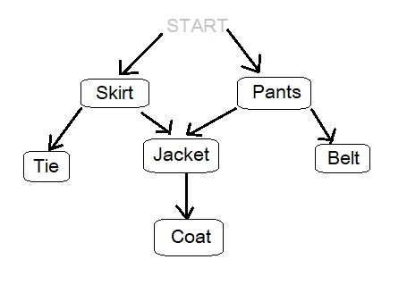

## Table of contents
* [General info](#general-info)
* [Task info](#task-info)
* [Algorithm Schema](#algorithm-schema)
* [Technologies](#technologies)
* [Setup](#setup)
* [Status](#status)
* [Inspiration](#inspiration)
* [Contact](#contact)

## General info
My beginnings in learning algorithms. The motivation was to learn how to solve problems with code. 
I would like to compare several ways to implement graph in this repo, therefore I marked the project as _in progress_.

## Task info
There are two tasks:
* How many clothes you need to wear before you put on a jacket?
* What is the correct order in dressing clothes?

We got a string that contains connections between clothes:

```javascript
"Skirt-Tie,Pants-Belt,Pants-Jacket,Jacket-Coat,Skirt-Jacket"
```
For example, "Skirt-Tie" means that we can't wear Tie without dressing Skirt.

We need to dress Skirt AND Pants to put on jacket. So answer to task 2 is "2". But how we implement this?

First, we need to parse this string into a hash table/dictionary.

## Algorithm Schema
Graph unilaterally directed




## Technologies
* Pure Javascript
* HTML 5


## Setup
There is no necessary setup. 


## Features
Expected features:
* dict/hash map
* neighborhood matrix
* incident matrix
* list of neighborhoods (list of successors and list of predecessors)
* topological search 

To-do list:
* Write real implementation of code solution in pure JavaScript
* Try to write implementation in Ruby
* Try another ways of solving task

## Status
Project is: _in progress_

## Inspiration
Based on my first pair coding challenge experience and khan academy materials. 

For more examples of such algorithms you can visit [Hackerrank page](https://www.hackerrank.com/graphs/). 

## Contact
Created by [@lapinskap](https://www.facebook.com/paulina.lapinska99) - feel free to contact me!
