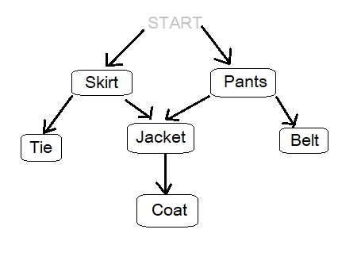

## Table of contents
* [General info](#general-info)
* [Algorithm Schema](#algorithm-schema)
* [Technologies](#technologies)
* [Setup](#setup)
* [Status](#status)
* [Inspiration](#inspiration)
* [Contact](#contact)

## General info
My beginnings in learning algorithms. The motivation was to learn how to solve problems with code. 
I would like to compare several ways to create graphs in this repo, therefore I marked the project as _in progress_.

## Algorithm Schema

some images here

## Technologies
* Pure Javascript
* HTML 5

## Setup
There is no necessary setup. 

## Features
List of features ready and TODOs for future development
* Awesome feature 1
* Awesome feature 2
* Awesome feature 3

To-do list:
* Wow improvement to be done 1
* Wow improvement to be done 2

## Status
Project is: _in progress_

## Inspiration
Based on my first pair coding challenge experience and khan academy materials. 

## Contact
Created by [@lapinskap](https://www.facebook.com/paulina.lapinska99) - feel free to contact me!
